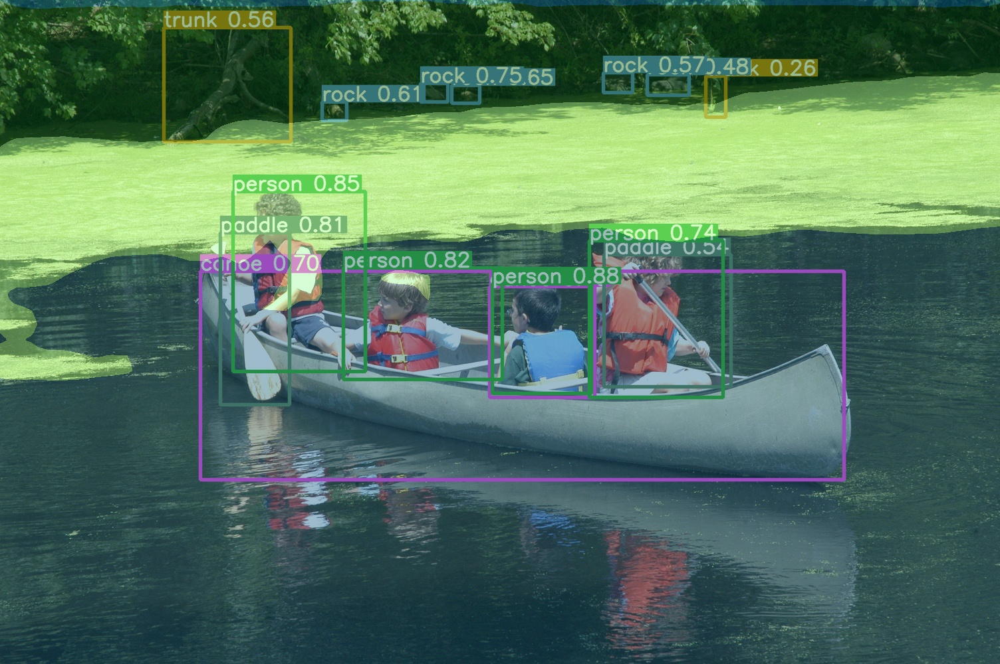

# Joint Object Detection and Semantic Segmentation
Model based on CNNs that integrates object detection and semantic segmentation in lentic water scenes to simultaneously identify and localize navigational obstacles and amorphous semantic structures such as cyanobacterial blooms, water bodies, among others.

